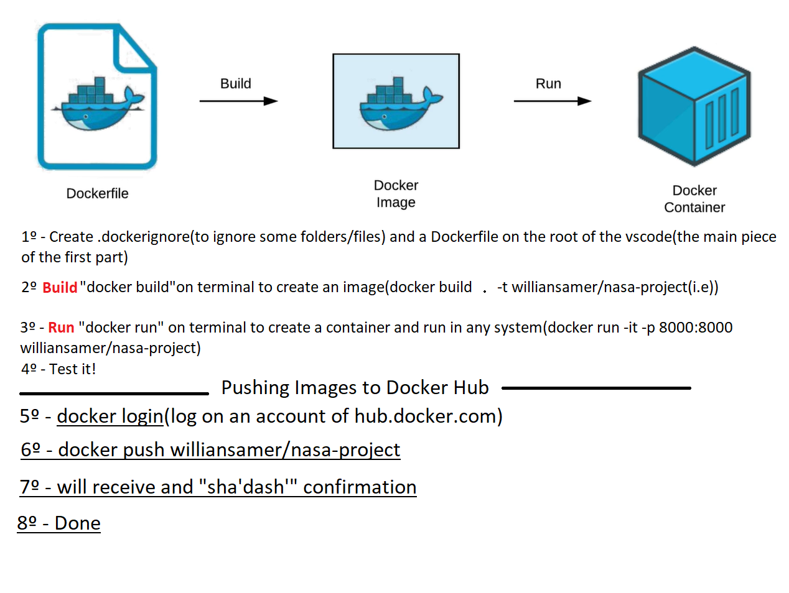

# DOCKER

________________________________

# Run ssh to control the EC2 instance

- cd ssh-key-pairs

- ssh -i "nasa-project-key-pair.pem" ec2-user@54.83.177.255

- sudo yum update -y

- sudo service docker start

_________________________________

### testing

- "docker info" >>> Error

- "sudo docker info" >>> OK

## Command to remove "sudo" before any docker command

- sudo usermod -a -G docker ec2-user

- exit

- ssh -i "nasa-project-key-pair.pem" ec2-user@54.83.177.255 (to log again)

##############################

## Login to Docker Hub

- docker login

- docker run -p --restart=always 8000:8000 williansamer/nasa-project

BONUS: docker container ls (see the what container is running)

## Remove container from specific port

- docker container ls

- docker rm -f <container-name>